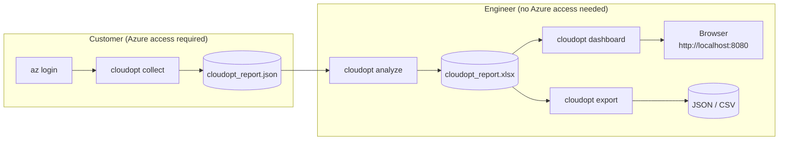
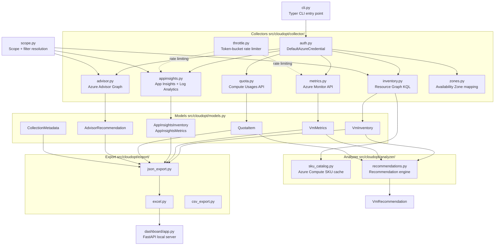

# cloudopt

**cloudopt** is a read-only Python CLI that collects Azure Virtual Machine inventory and
performance metrics across one or many subscriptions, producing a structured JSON artifact.
A separate `analyze` step transforms that JSON into an Excel workbook and launches a local
web dashboard — without requiring any Azure access on the analyst's machine.

> **Cloud Shell compatible** — `cloudopt collect` has no Excel dependency and runs in
> Azure Cloud Shell or any Python 3.11+ environment.  Customer data stays local and is
> **never written back to Azure**.

---

## Two-Phase Architecture



---

## How It Works

### Data Flow



### Request Rate Control

All Azure Monitor and ARM calls go through `ThrottleManager` in `throttle.py`:

```
┌─────────────────────────────────────────────────────────┐
│  ThrottleManager (per subscription)                     │
│                                                         │
│  asyncio.Semaphore ──── max concurrent calls (default 5)│
│  TokenBucket       ──── max requests/sec   (default 20) │
│  ExponentialBackoff──── on 429 / transient errors       │
└─────────────────────────────────────────────────────────┘
```

Subscriptions are always processed **one at a time**; VMs and App Insights
components within a subscription are batched in parallel up to `--concurrency`.

### Scope Filtering

All filters are resolved by `scope.py` and applied in this strict order:

```
Tenant → Subscriptions → Locations (Regions) → ResourceGroups → Tags
```

Tag values are **kept in memory only** and are never written to any output file.

### Recommendation Engine (`analyzer/recommendations.py`)

The engine produces one or more `VmRecommendation` records per VM, grouped into
five umbrella categories:

| Category             | Signal                                           |
| -------------------- | ------------------------------------------------ |
| `QUOTA_OPTIMIZATION` | Quota tiers approaching or exceeding thresholds  |
| `SKU_SWAP`           | Same size class, different SKU family            |
| `RESIZING`           | Underutilized / memory-bound → right-sized SKU   |
| `MODERNIZATION`      | Legacy SKU or IaaS → PaaS migration candidate    |
| `REGION_EXPANSION`   | Cross-subscription / cross-region redistribution |

---

## Installation

**From GitHub** (Azure Cloud Shell or any internet-connected machine):
```bash
pip install git+https://github.com/Azure/cloudopt.git
```

**From a zip file** (offline / air-gapped delivery):
```bash
unzip cloudopt.zip && cd cloudopt && pip install .
```

**From a local clone** (contributors):
```bash
git clone https://github.com/Azure/cloudopt.git
cd cloudopt && pip install -e ".[dev]"
```

Verify: `cloudopt version`

---

## Quick Start

```bash
# 1. Authenticate
az login

# 2. Collect from all accessible subscriptions (30 days of metrics)
cloudopt collect --output output/

# 3. Share output/cloudopt_report.json with the analyst/engineer
```

The engineer then runs (no Azure access required):

```bash
# Generate the Excel workbook
cloudopt analyze --from output/cloudopt_report.json

# Browse in a local dashboard
cloudopt dashboard --data output/cloudopt_report.xlsx
```

---

## Commands

| Command              | Who runs it | Description                                            |
| -------------------- | ----------- | ------------------------------------------------------ |
| `cloudopt collect`   | Customer    | Full collection: inventory + metrics + quota + Advisor |
| `cloudopt analyze`   | Engineer    | Generates Excel workbook from JSON                     |
| `cloudopt dashboard` | Engineer    | Local FastAPI web dashboard                            |
| `cloudopt export`    | Engineer    | Re-exports workbook to JSON / CSV                      |
| `cloudopt version`   | Anyone      | Print version                                          |

See [HOW_TO.md](HOW_TO.md) for full option reference.

---

## What Is Collected

### Azure Virtual Machines

- **Inventory**: resource ID, subscription, resource group, region, zone, SKU, vCPUs,
  memory, OS type, OS image, disk layout, NIC count, power state, VMSS / availability-set
- **Metrics** (30-day default, configurable 1–90 days):

| Metric                       | Stats              |
| ---------------------------- | ------------------ |
| CPU %                        | avg, P50, P95, max |
| Available Memory Bytes       | avg, P50, P95, max |
| Disk Read / Write Bytes/sec  | avg, P50, P95, max |
| Disk Read / Write IOPS       | avg, P50, P95, max |
| Network In / Out Total Bytes | avg, P50, P95, max |

### Application Insights

Standard metrics (Availability, Requests, Exceptions, Performance) via Azure Monitor.
JVM metrics (heap, GC, threads) via Log Analytics for workspace-linked components.

### Azure Advisor

SKU-change and right-sizing recommendations from the Advisor resource graph.

### Quota Utilisation

Compute core quota usage per subscription + region, flagged when ≥ 80 % (configurable).

---

## Authentication

Uses `DefaultAzureCredential` — tries in order:

1. **Azure CLI** — `az login` *(recommended for interactive use)*
2. **Environment variables** — `AZURE_CLIENT_ID`, `AZURE_TENANT_ID`, `AZURE_CLIENT_SECRET`
3. **Managed Identity** — automatic when running inside Azure / Cloud Shell

---

## Project Structure

```
src/cloudopt/
├── cli.py                  # Typer CLI entry point (collect / analyze / dashboard / export)
├── models.py               # Pydantic v2 data models (VmInventory, VmMetrics, …)
├── scope.py                # Scope + filter resolution
├── config.py               # Interactive threshold prompts
├── collector/
│   ├── auth.py             # DefaultAzureCredential helpers, subscription enumeration
│   ├── inventory.py        # VM inventory via Resource Graph (cross-subscription KQL)
│   ├── metrics.py          # Azure Monitor per-VM metrics, checkpoint/resume
│   ├── appinsights.py      # App Insights inventory + Standard + JVM metrics
│   ├── advisor.py          # Azure Advisor SKU recommendations via Resource Graph
│   ├── quota.py            # Compute quota usage per subscription + region
│   ├── zones.py            # Availability-zone physical→logical mapping
│   └── throttle.py         # Token-bucket rate limiter + exponential backoff
├── analyzer/
│   ├── sku_catalog.py      # Azure Compute SKU cache (vCPUs, memory per region)
│   └── recommendations.py  # Recommendation engine (5 categories, priority scoring)
├── export/
│   ├── json_export.py      # JSON serialisation (subscription IDs masked)
│   ├── excel.py            # Multi-sheet Excel workbook generation (openpyxl)
│   └── csv_export.py       # CSV export (one file per logical sheet)
└── dashboard/
    ├── app.py              # FastAPI REST API + static frontend
    └── templates/
        └── index.html      # Single-page dashboard UI
tests/                      # pytest tests (136 tests, mock Azure SDK clients)
```

---

## Key Design Decisions

| Decision                          | Rationale                                                                    |
| --------------------------------- | ---------------------------------------------------------------------------- |
| JSON-first output                 | Collector runs in Cloud Shell (no Excel); analyst generates workbook locally |
| Read-only                         | Never writes to Azure resources                                              |
| `DefaultAzureCredential` only     | No secrets in code; works with CLI, MI, env vars                             |
| Resource Graph for inventory      | Single cross-subscription KQL call instead of per-RG ARM calls               |
| Token-bucket rate limiter         | ARM has per-subscription read budget; prevents 429 errors                    |
| Subscription IDs masked in output | Reduces accidental exposure when sharing JSON                                |
| Tag values never persisted        | Tag filters are in-memory only                                               |

---

## Running Tests

```bash
pytest                                   # all tests
pytest --cov=cloudopt --cov-report=term  # with coverage
pytest tests/test_metrics.py             # single file
```

---

## Documentation

| Guide                        | Purpose                                                                        |
| ---------------------------- | ------------------------------------------------------------------------------ |
| [HOW_TO.md](HOW_TO.md)       | Installation, authentication, quick start, command overview                    |
| [COLLECTOR.md](COLLECTOR.md) | Full `collect` reference — options, scope files, thresholds, what is collected |
| [ANALYZER.md](ANALYZER.md)   | Excel generation, dashboard, export, workbook structure, analyst-editable fields |
| [REPORTER.md](REPORTER.md)   | Final report generation from the analyzed workbook *(coming soon)*             |

---

## License

MIT
